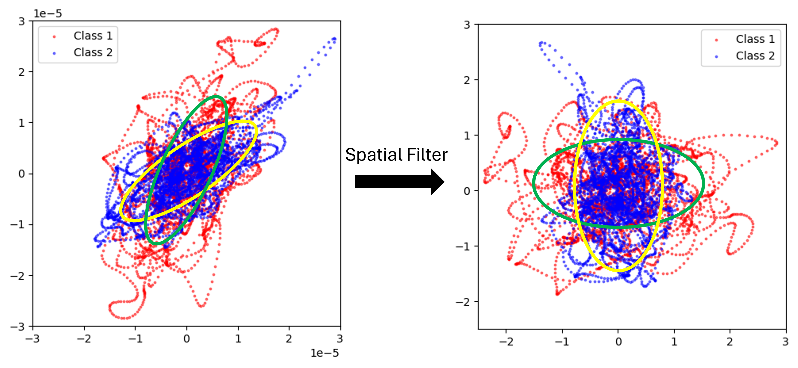

# Introduction of Common Spatial Pattern(CSP) Algorithm

Common spatial pattern (CSP) is a spatial filtering algorithms commonly used in the field of Brain-Computer Interface (BCI), especially in the classification of motor imagery paradigms, which is one of the benchmark algorithms for motor imagory paradigms. 

We will start from the purpose of CSP algorithm, and tries to elucidate the connection between the mathematical ideas and neuroscience.

## The general idea of CSP and the explanation of the name of the algorithm
The purpose of CSP Algorithm is to design a linear transform, which can also be called as spatial filter, mapping the original data into a new space which is more discriminative. The following figure is an example, which use a spatial filter project two classes of EEG epoch into a 2D feature space.

<!--This post will show up by default. To disable scheduling of future posts, edit `config.yml` and set `future: false`. -->
